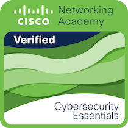

- 💞️ I’m looking to collaborate on Android Development or Web Development, and being part of a company not as a service provider, but as a key piece of the team!
- 📫 How to reach me Email(richard-hgs@hotmail.com), Instagram([@richardgss](https://www.instagram.com/richardgss/)), Linked-in([@richardgs](https://www.linkedin.com/in/richard-garcia-de-souza-0a0b72140))
- 🍵 If you like my work [buy me a coffe](https://www.buymeacoffee.com/richardgs) 🍵

### Certificates

### Activity Tracker 

<!---
richard-hgs/richard-hgs is a ✨ special ✨ repository because its `README.md` (this file) appears on your GitHub profile.
You can click the Preview link to take a look at your changes.
--->
